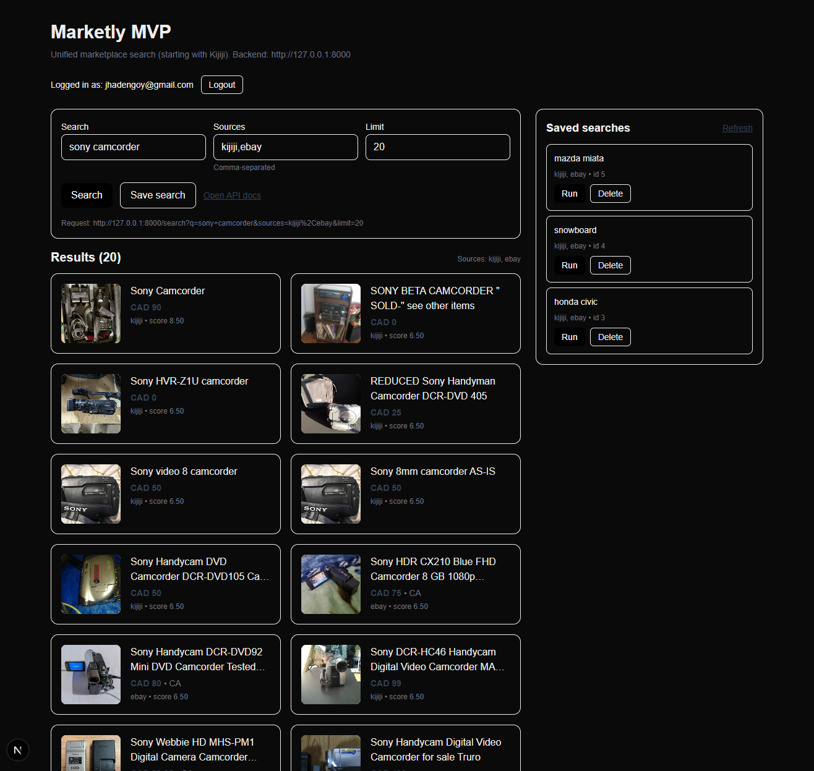

<!-- Improved compatibility of back to top link: See: https://github.com/othneildrew/Best-README-Template/pull/73 -->
<a id="readme-top"></a>
<!--
*** Thanks for checking out the Best-README-Template. If you have a suggestion
*** that would make this better, please fork the repo and create a pull request
*** or simply open an issue with the tag "enhancement".
*** Don't forget to give the project a star!
*** Thanks again! Now go create something AMAZING! :D
-->


<!-- PROJECT SHIELDS -->
<!--
*** I'm using markdown "reference style" links for readability.
*** Reference links are enclosed in brackets [ ] instead of parentheses ( ).
*** See the bottom of this document for the declaration of the reference variables
*** for contributors-url, forks-url, etc. This is an optional, concise syntax you may use.
*** https://www.markdownguide.org/basic-syntax/#reference-style-links
-->
![Contributors][contributors-shield]
![Issues][issues-shield]


<!-- PROJECT LOGO -->
<br />
<div align="center">
  <a href="">
    
  </a>
</div>

<!-- PROJECT HEADER SECTION (Links need to be added later down the line) -->

<h3 align="center">
  <a>Marketly</a>
</h3>


  <p align="center">
    Modular marketplace tracking platform that aggregates and normalizes listings from multiple online marketplaces into a single, unified system.
    <br />
    <a href=""><strong>Explore the docs (Coming Soon)»</strong></a>
    <br />
    <br />
    <a href="">View Demo</a>
    &middot;
    <a href="">Report Bug</a>
    &middot;
    <a href="">Request Feature</a>
  </p>
</div>


<!-- TABLE OF CONTENTS -->
<details>
  <summary>Table of Contents</summary>
  <ol>
    <li>
      <a href="#about-the-project">About The Project</a>
      <ul>
        <li><a href="#built-with">Built With</a></li>
      </ul>
    </li>
    <li>
      <a href="#getting-started">Getting Started</a>
      <ul>
        <li><a href="#prerequisites">Prerequisites</a></li>
        <li><a href="#installation">Installation</a></li>
      </ul>
    </li>
    <li><a href="#roadmap">Roadmap</a></li>
  </ol>
</details>


<!-- ABOUT THE PROJECT -->
## About The Project
<div align="center">

</div>

Marketly is a unified marketplace search platform that aggregates listings from multiple sources into a single, streamlined interface. Instead of manually browsing Kijiji, eBay, and other marketplaces separately, users can search across supported platforms simultaneously and compare results in real time. The application features secure user authentication, per-user saved searches, and live result fetching to ensure listings are always up to date. Marketly’s backend integrates directly with official APIs and custom scrapers, normalizing data into a consistent format for a seamless browsing experience. The system is designed with modular marketplace connectors, making it easy to expand and support additional platforms. Marketly aims to simplify online buying by centralizing fragmented marketplace ecosystems into one powerful search tool.

### Key Features:
* Multi-Source Search
* Real-Time Results
* Secure Authentication
* Per-User Saved Searches
* Normalized Listings
* Modular Connector Architecture

<p align="right">(<a href="#readme-top">back to top</a>)</p>

### Built With
**Frontend** 
* ![Next.js][Next.js]
* ![React][React]
* ![Typescript][Typescript]
* ![TailwindCSS][TailwindCSS]


**Backend** 
* ![Python][Python]
* ![FastAPI][FastAPI]
* ![SQLAlchemy][SQLAlchemy]

<p align="right">(<a href="#readme-top">back to top</a>)</p>


## Getting Started

To get a local copy up and running follow these steps.

### Prerequisites

* Node.js 18+ (or current LTS)
* Python 3.10+
* Docker Desktop
* Environment Variables (please contact)

### Installation

1. Clone the repo
```powershell
git clone https://github.com/jhadenn/Marketly
```
2. Backend (local)
```powershell
cd backend
python -m venv .venv
.venv\Scripts\activate
pip install -e ".[dev]"
uvicorn app.main:app --reload
```
3. Frontend (local)
```powershell
cd frontend
npm install
npm run dev
```
4. Database (Docker)
```powershell
cd backend
docker compose up -d
```


<p align="right">(<a href="#readme-top">back to top</a>)</p>


<!-- ROADMAP -->
## Roadmap


- [X] Aggregate listings from Kijiji
- [X] Add normalization for search results
- [X] Develop API support for Kijiji
- [X] Develop API support for eBay
- [X] Connect database
- [X] Create basic frontend
- [X] Add auth
- [] Add filters and sorting
- [] Pagination / infinite scroll
- [] Better loading states
- [] Edit saved searches
- [] Notifications
- [] Polish front end
- [] Rate limiting, caching
- [] Deploy

See the [open issues](https://github.com/jhadenn/Marketly) for a full list of proposed features (and known issues).

<p align="right">(<a href="#readme-top">back to top</a>)</p>

<!-- Shield Links -->

<!-- Github Related -->
[contributors-shield]: https://img.shields.io/github/contributors/jhadenn/Marketly.svg?style=for-the-badge
[issues-shield]: https://img.shields.io/github/issues/jhadenn/Marketly.svg?style=for-the-badge

<!-- Frontend -->
[Next.js]: https://img.shields.io/badge/Next.js-000000?style=for-the-badge&logo=nextdotjs&logoColor=white
[React]:https://img.shields.io/badge/-ReactJs-61DAFB?logo=react&logoColor=white&style=for-the-badge
[TypeScript]: https://img.shields.io/badge/Typescript-3178C6?logo=typescript&logoColor=white&style=for-the-badge
[TailwindCSS]:https://img.shields.io/badge/TailwindCSS-06B6D4?logo=tailwind-css&logoColor=white&style=for-the-badge

<!-- Backend -->
[Python]: https://img.shields.io/badge/Python-3776AB?style=for-the-badge&logo=python&logoColor=white
[FastAPI]: https://img.shields.io/badge/FastAPI-009688?style=for-the-badge&logo=fastapi&logoColor=white
[SQLAlchemy]: https://img.shields.io/badge/SQLAlchemy-D71F00?style=for-the-badge&logo=sqlalchemy&logoColor=white